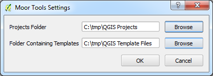
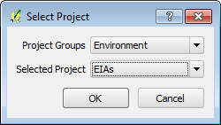
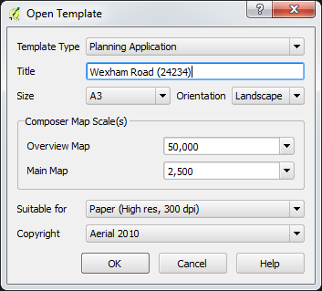
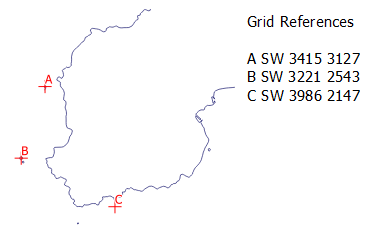

# Project and Template Selector (QGIS Plugin)

Tools for simplifying and automating common tasks for national parks and other protected areas.

## Status

Although fully functional, this plugin has not yet been polished for release to the official QGIS plugin repository.

You can install the latest version of the plugin from Lutra Consulting [public repository](https://qgis.lutraconsulting.co.uk/lutraconsulting/plugins.xml):

https://qgis.lutraconsulting.co.uk/lutraconsulting/plugins.xml

Please note this plugin has been developed for very specific use cases and as such may require further work to make it more generic to suit users' wider requirements. Please feel free to create [GitHub *issues*](https://github.com/lutraconsulting/qgis-moor-tools-plugin/issues) for reporting any bugs, queries or feature requests.

## Configuration

Tools can be configured from within QGIS via Plugins Menu > Project and Template Selector > Configure Project and Template Selector.

 

### Projects Folder (Project Selector)

The _Project Selector_ simplifies project selection on QGIS startup by presenting the user with a number of grouped projects:

The _Projects Folder_ configuration option should point to a folder with a structure like this:

- top-level container folder
	- Environment (folder)
		- EIAs.qgs
	- Planning (folder)
		- Highways.qgs
		- Planning Applications.qgs
		- default.txt

QGIS project files (.qgs files) are grouped into folders. Folder names are used to populate the _Project Groups_ drop-down menu. A file called ``default.txt`` placed under a group folder can be used to influence the default selected project. Within ``default.txt`` specify the name of the default project (case sensitive, '.qgs' suffix optional).   

### Folder Containing Templates (Template Selector)

The _Template Selector_ simplifies the process of selecting and configuring QGIS print composer templates (.qpt files) and provides a dialog like this:

The _Folder Containing Templates_ configuration option specifies the path to a folder containing the .qpt files. The folder structure should look similar to the example below:

- top-level container folder
	- Planning Application
		- A4L.qpt
		- A4P.qpt
		- A3L.qpt
		- images (folder)
			- logo.gif
		- Copyrights (folder)
			- Ordnance Survey.txt
			- Aerial 2010.txt
			- default.txt
	- Environmental Impact Assessment
		- ... (similar folder content to previous example

The names of the folders under the top-level container folder (e.g. _Planning Application_) are used to identify the type of print composer template (see image above).

In the example above the _Planning Application_ template is available as A4 (Landscape and Portrait) and A3 (Landscape). All ISO A series sizes are supported.

In this case the optional _images_ folder contains any logos or other images referenced by the associated .qpt files. 

The optional _Copyrights_ folder contains the copyright text(s) available when using the _Planning Application_ composer template. _default.txt_ can optionally be used to specify the default copyright text for the template. This is configured as described above for the _Project Selector_.

### Show on QGIS startup (Project Selector)

Whether or not to show the project selector dialog on QGIS startup - note that this dialog does not appear if QGIS is invoked directly on a project (.qgs) file.

### Customising the Help URL

You may be using Moor Tools as part of a wider QGIS deployment. In this case you may wish to override the destination URL of the Help button with your own content. This can be achieved by altering the definition of ``helpUrl`` towards the bottom of _templateselectordialog.py_ in the plugin source files.

## Creating Templates

This section describes how to create effective composer templates.

### String Replacement

_Template Selector_ supports automatic replacement of strings in addition to those already supported by QGIS. The following strings will automatically be replaced within composer templates:

- [username] : the user's username (e.g. %USERNAME%), specified as environment variable
- [title] : The _Title_ specified by the user in the above dialog
- [subtitle] : The _Sub-title_ specified by the user in the above dialog
- [copyright] : The content of the selected copyright file

NOTE: If you update from QGIS 2 print templates, in QGIS 3 it is necessary to set up 'id' fields of the items above as 'author', 'title', 'subtitle', 'copyright', respectively.
### Multiple Composer Maps    

Templates with multiple composer maps are supported. Composer maps are identified by their _Item ID_ property wherever present and their scales can be set independently.

### Points of Interest

You may wish to highlight specific points on interest in your maps: 

This can be achieved as follows:

1. Create a new (point) layer describing your points of interest
	1.  The example above included a field called 'label'
2. Digitise your points of interest and add label values as required
3. Style and label the layer as you wish it to appear in the print composer
	1. The example above uses a red cross and associated label with buffer
4. Choose a compatible template (these are explained below)
	1. The _POI Layer_ options should now become active
5. Select the points of interest layer and appropriate label field name

The resulting print composer output should show the grid references for the points of interest. 

### Creating Compatible Templates for Points of Interest

Creating compatible templates is easy, simply:

1. Add a label to the template
2. Under its _Item Properties_, set the _Item ID_ property to _gridref_

This label will be automatically updated with grid references of points of interest.    

## Troubleshooting

### Images Loading as Red Crosses

This can happen when references to files used in print composer templates have been saved using relative paths.

This can be resolved by:

1. QGIS > Project Properties > General tab > Save paths > absolute
2. Re-saving the composer template

Alternatively the .qpt file can be edited by hand to specify the absolute path to referenced files. 
